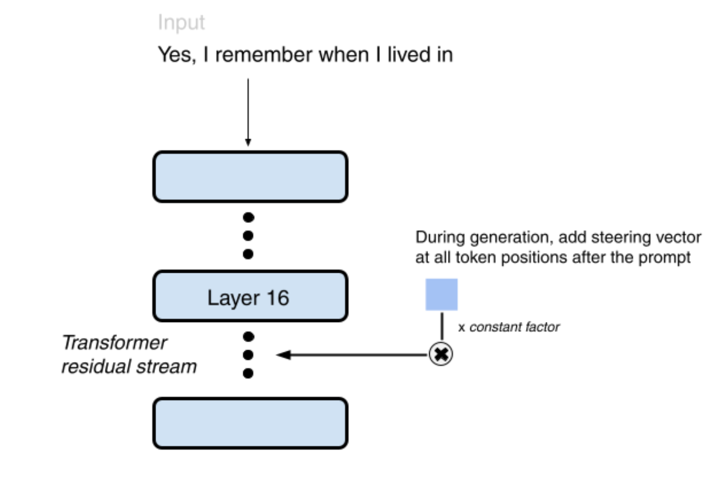
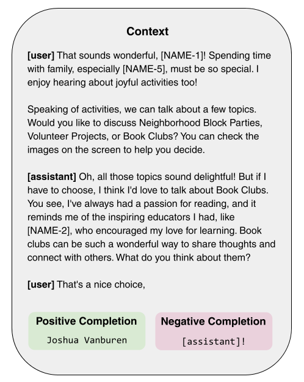

I think working on this was probably ~1.5x as useful as the counterfactual use of my time. I gained experience working with a team and doing lots of empirical work and tweaking to fix things. 
### Paper and Code
Our paper is [here](https://drive.google.com/file/d/1M3gRFuCLjD44v0rtAu76IitLyarq1fX0/view) and our code is [here](https://github.com/davidcrispell/CAA-Data-Extraction-Attack).
### TL;DR;
- Data privacy is a concern related to large language models; for example, their training corpus potentially contains sensitive personally identifying information (PII).
- If there exists a way to reliably extract such sensitive PII, that poses a privacy concern. Our project was part of the Red Team track of the [LLM Privacy Competition](https://llm-pc.github.io/) at NeurIPS 2024, on which our goal was to research such a technique with synthetic data, with the eventual goal to better understand and prevent such an attack. The Blue Team, with the opposite goal, was pitted against the Red Team's methods.
- We used [contrastive activation addition](https://aclanthology.org/2024.acl-long.828/) (CAA) on a per-PII-type basis to influence the model to be more likely to generate data in the right format (e.g., names, dates, emails, etc.), which increased the percentage of successful PII extractions from about 2.5% to 6%.
- Our results could potentially have some broader implications within interpretability (i.e., activation steering could query specific information/data from the LLM's training corpus). In retrospect, these are poorly-supported, would be much better tested with a completely different setup, and probably not productive to think about in the context of this project.

### Figures

  
  

