

OTHER

Friends

<a href="https://davidcrispell.github.io/">David</a>
<a href="https://lawliet.org/">Thomas</a>
<a href="https://eviehu612.github.io/">Evie</a>
<a href="https://swan.one/">Stephanie</a>
<a href="https://www.kaustubhais.com/">Kaustubh</a>
<a href="https://nolinkedin.com/" data-group="Anish">Anish #1</a>
<a href="https://anishlk.com/" data-group="Anish">Anish #2</a>
<a href="https://total-anayalation.github.io/">Anaya</a>
<a href="https://anastasiakwei.github.io/">Anastasia</a>
<a href="https://zoya.sh/">Zoya</a>
<a href="https://aryais.com/">Arya</a>
<a href="https://www.aryansharma.com/">Aryan</a>
<a href="https://harshul.org/">Harshul</a>
<a href="https://www.nisakeshwani.com/">Nisa</a>
<button class="folio-shuffle" type="button" aria-label="Shuffle friends">⇄</button>

Websites I've designed

<a href="https://coby.lk/">coby.lk</a>
<a href="https://www.yaleaia.org/">yaleaia.org</a>
<a href="https://yaleeffectivealtruism.com/">yaleeffectivealtruism.com</a>

Art hoard

<button type="button" class="yt-facade" data-video-id="Q1jBjhEvruw" aria-label="Play: Sciarrino, Melencolia I">

</button>
Sciarrino, Melencolia I

<a href="https://www.lesswrong.com/s/WnTvZdXz2q9ySfr4o/p/SvKSwT6xYfYahH4XN">Universal Love, Said the Cactus Person</a>
Scott Alexander

<figure class="scrap scrap-img">
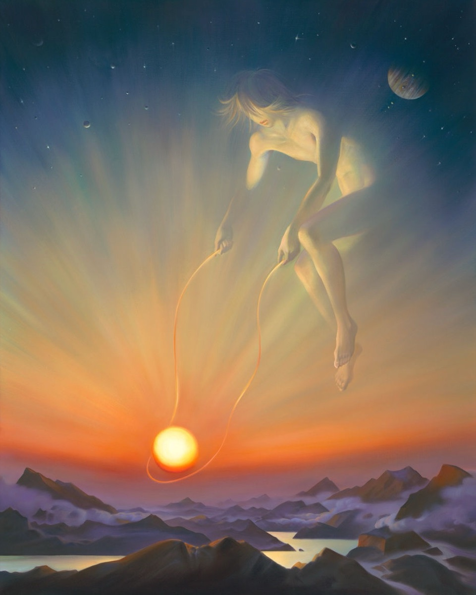
<figcaption>Vladimir Kush, <em>Cosmic Envoy</em></figcaption>
</figure>

<figure class="scrap scrap-img">
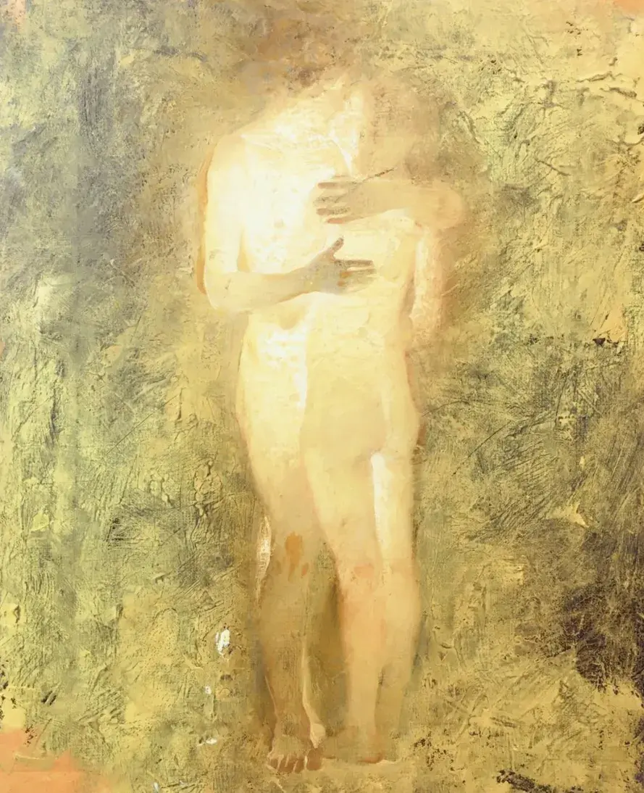
<figcaption>Ivan Pokidishev, <em>Golden Haze</em>, 2022</figcaption>
</figure>

<a href="https://forum.effectivealtruism.org/posts/CfcvPBY9hdsenMHCr/integrity-for-consequentialists-1">Integrity for Consequentialists</a>
Paul Christiano

<button type="button" class="yt-facade" data-video-id="wjULTZEq4BY" aria-label="Play: Sciarrino, Ai limiti della notte">

</button>
Sciarrino, Ai limiti della notte

<a href="https://turntrout.com/on-being-robust">On Being Robust</a>
Alex Turner

<figure class="scrap scrap-img">
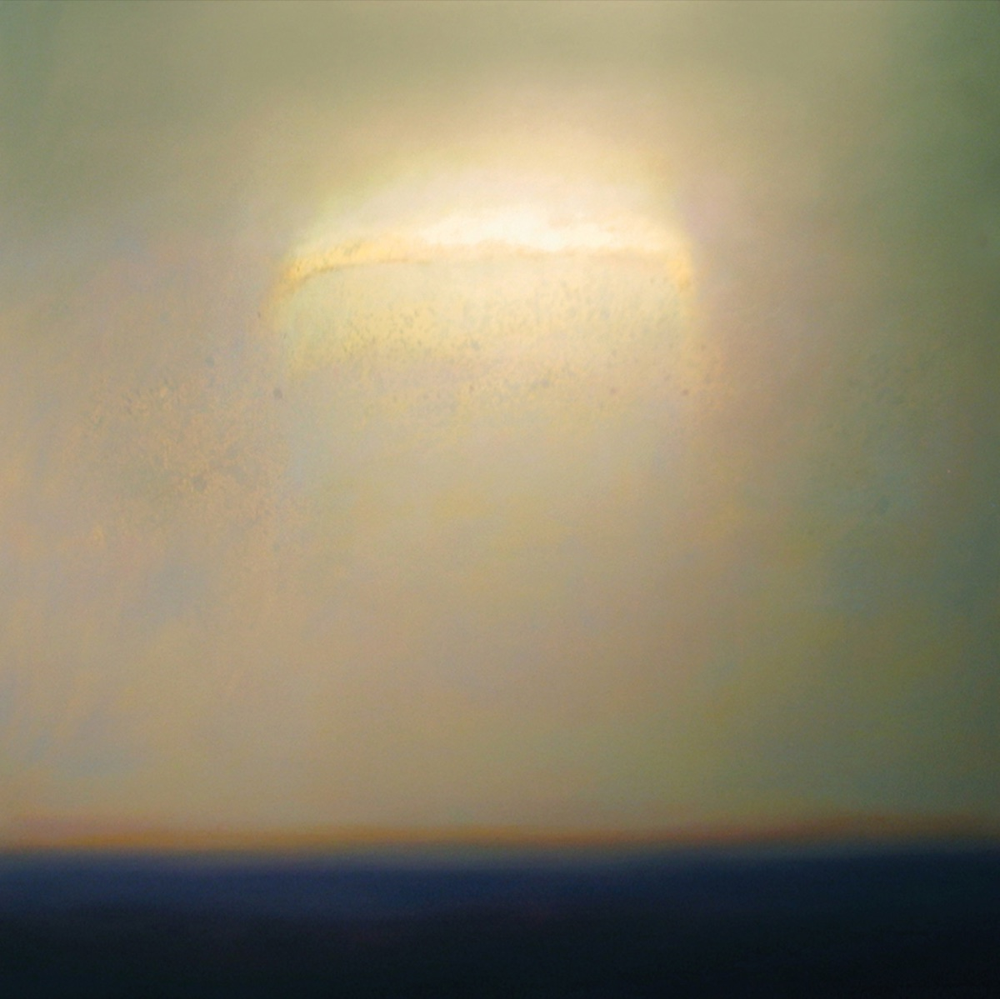
<figcaption>Steven DaLuz, <em>Source</em></figcaption>
</figure>

<h3>The Despairing Man Draws a Serpent</h3>

I went up the hill 
At moonrise. 
She swore that she would come 
By the south way. 
A dusky hawk 
Caught up the path 
In his talons.

Pablo Antonio Cuadra, tr. Thomas Merton

<button type="button" class="yt-facade" data-video-id="Rx4CZ7WRRvc" aria-label="Play: Sciarrino, La perfezione di uno spirito sottile">

</button>
Sciarrino, La perfezione di uno spirito sottile

<figure class="scrap scrap-img">
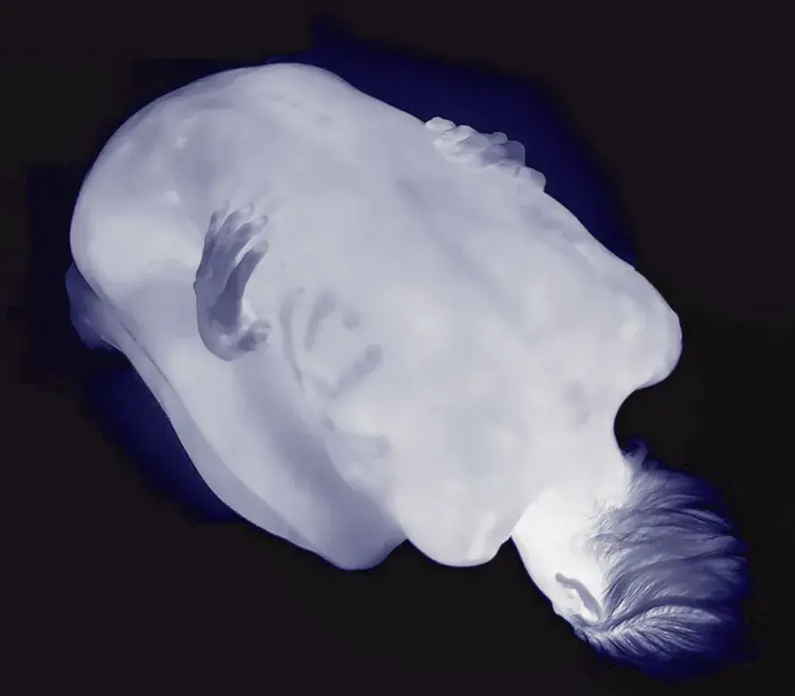
<figcaption>Ivan Pokidishev, <em>34.2 °C</em>, 2023</figcaption>
</figure>

<button type="button" class="yt-facade" data-video-id="Fmw82oNB6Wg" aria-label="Play: Yoshimatsu, Threnody to Toki">

</button>
Yoshimatsu, Threnody to Toki

<figure class="scrap scrap-img">
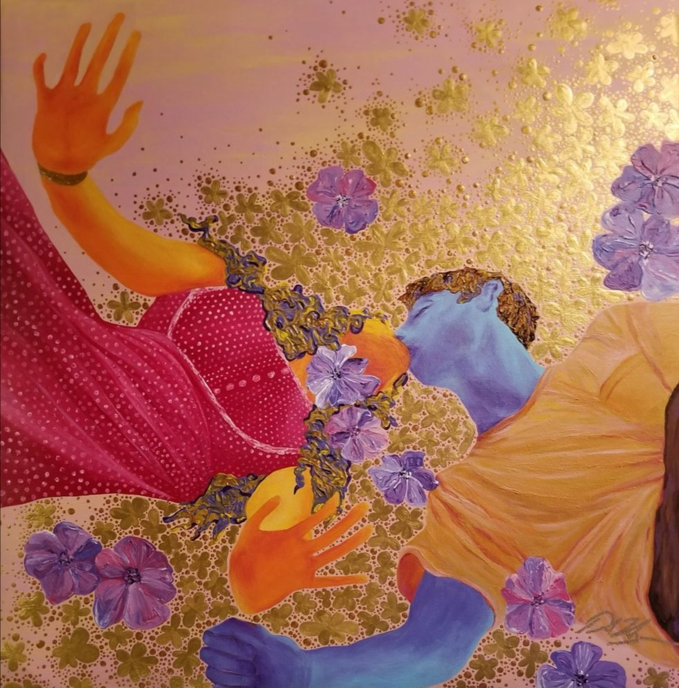
<figcaption>T. A. Volgenau, <em>Smooch Blossoms</em></figcaption>
</figure>

<h3>Politics</h3>

‘In our time the destiny of man presents its meanings in political terms.’ —Thomas Mann

How can I, that girl standing there, 
My attention fix 
On Roman or on Russian 
Or on Spanish politics, 
Yet here’s a travelled man that knows 
What he talks about, 
And there’s a politician 
That has both read and thought, 
And maybe what they say is true 
Of war and war’s alarms, 
But O that I were young again 
And held her in my arms.

W. B. Yeats

<figure class="scrap scrap-img">
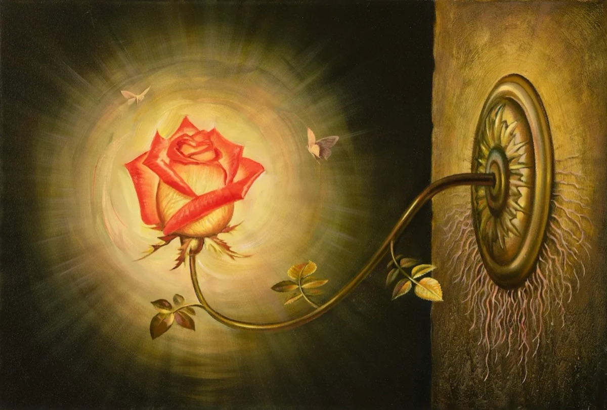
<figcaption>Vladimir Kush, <em>Street Lantern</em></figcaption>
</figure>

<figure class="scrap scrap-img">
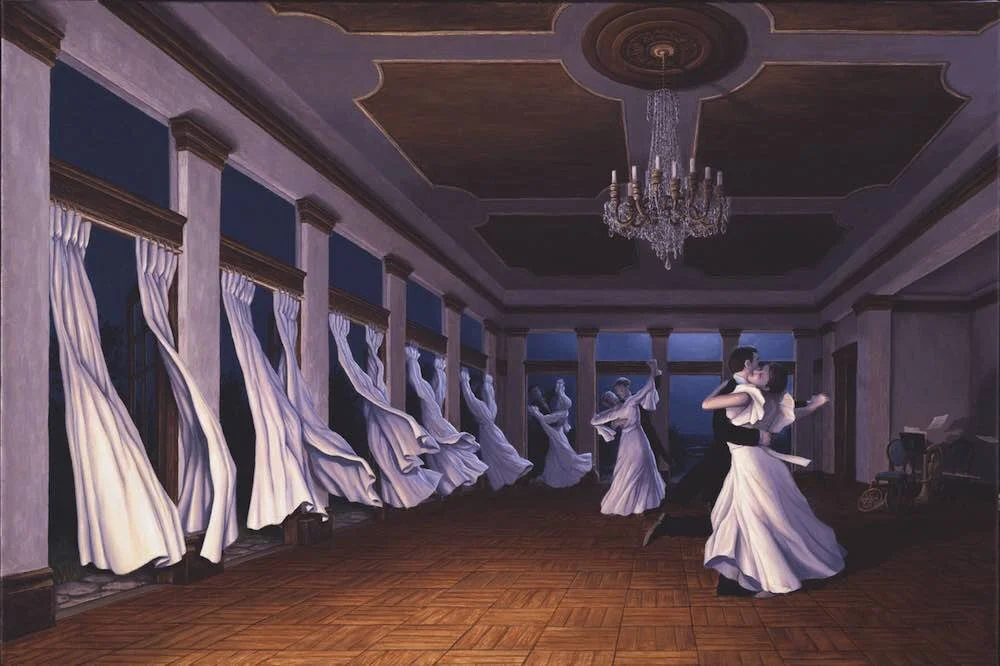
<figcaption>Rob Gonsalves, <em>Dancing Wind</em></figcaption>
</figure>

<button type="button" class="yt-facade" data-video-id="cLZg_vjgIYY" aria-label="Play: Takemitsu, And Then I Knew ’Twas Wind">

</button>
Takemitsu, And Then I Knew ’Twas Wind

<figure class="scrap scrap-img">
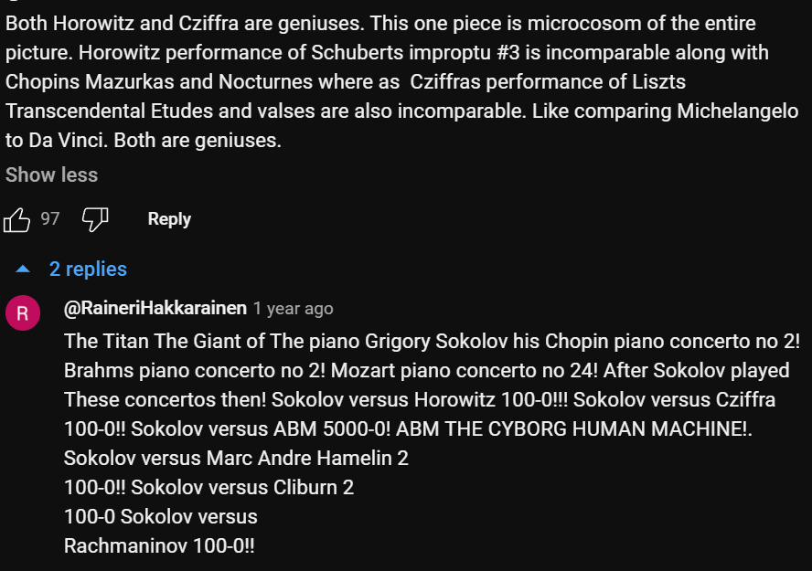
<figcaption>my favorite youtube comment reply</figcaption>
</figure>

<h3>Amores I</h3>
<pre>consider O
woman this
my body.
for it has
&nbsp;
lain
with empty arms
upon the giddy hills
to dream of you,
&nbsp;
approve these
firm unsated
eyes
which have beheld
&nbsp;
night’s speechless carnival
the painting
of the dark
with meteors
&nbsp;
streaming from playful
immortal hands
the bursting
of the wafted stars
&nbsp;
(in time to come you shall
remember of this night amazing
esctasies    slowly,
in the glutted
&nbsp;
heart fleet
flowerterrible
memories
shall
&nbsp;
rise,slowly
return upon the
               red elected lips
&nbsp;
scaleless visions)</pre>
E. E. Cummings, Tulips and Chimneys

<figure class="scrap scrap-img">
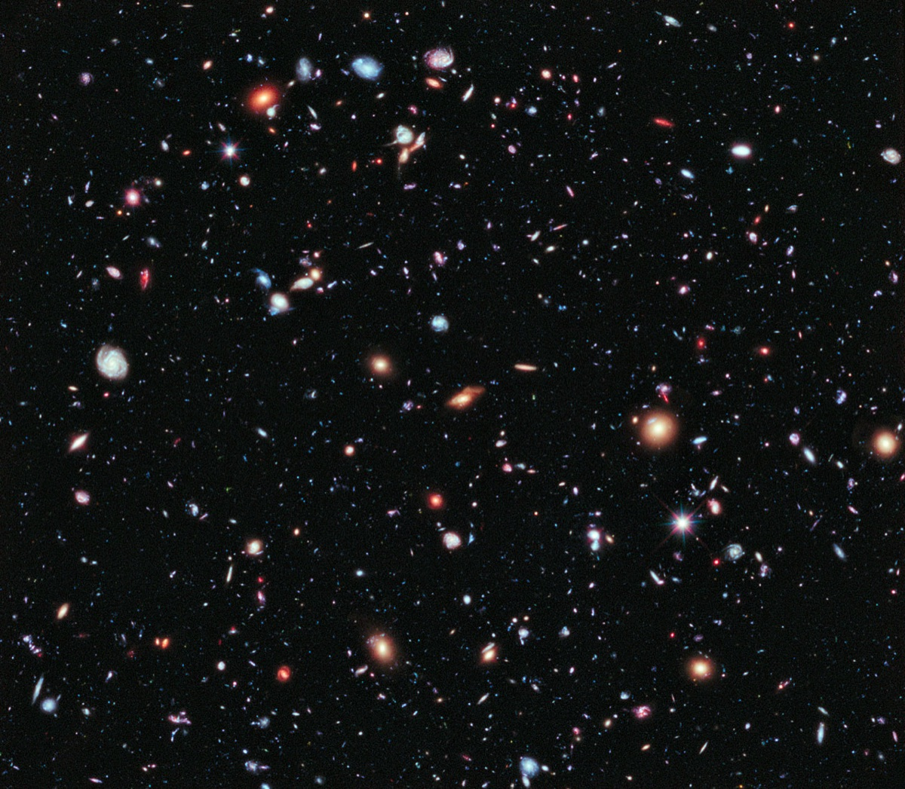
<figcaption>NASA/ESA, <em>Hubble eXtreme Deep Field</em>, 2012</figcaption>
</figure>

<button type="button" class="yt-facade" data-video-id="LorP8xKKTh0" aria-label="Play: Kate Soper, Nadja">

</button>
Kate Soper, Nadja

<button type="button" class="yt-facade" data-video-id="LCAt4mKhCpY" aria-label="Play: Kate Soper, Voices from the Killing Jar">

</button>
Kate Soper, Voices from the Killing Jar

<figure class="scrap scrap-img">
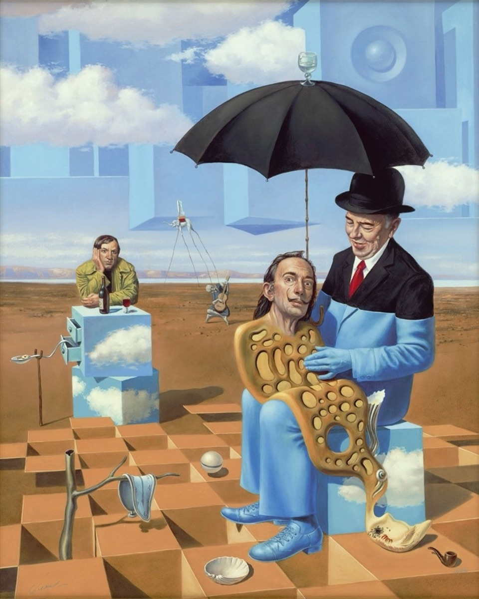
<figcaption>Michael Cheval, <em>Lullaby of Uncle Magritte</em></figcaption>
</figure>

<button type="button" class="yt-facade" data-video-id="Tczl9MdcmNM" aria-label="Play: Katherine Balch, drip music">

</button>
Katherine Balch, drip music

<h3>Despair</h3>

At moonrise a weariness comes over me, 
And I dream of trees holding up a sky, 
Beneath which I walk, seeking a lost road 
To the house of a friend.

And in this twilight of my brain 
I pray for a gate, 
Or a bridge, 
Or a tunnel, 
By which I may come to an end.

But there are no walls for gates, 
Or rivers for bridges, 
Or mountains for tunnels.

There is nothing to stop me, 
There is nothing to hold me.

Yet I must go on— 
For how can one rest 
Where there is neither wall nor hill nor sea, 
And where in the full darkness 
Little lights show 
Only to vanish as one approaches them?

Ernest Walsh

<figure class="scrap scrap-img">
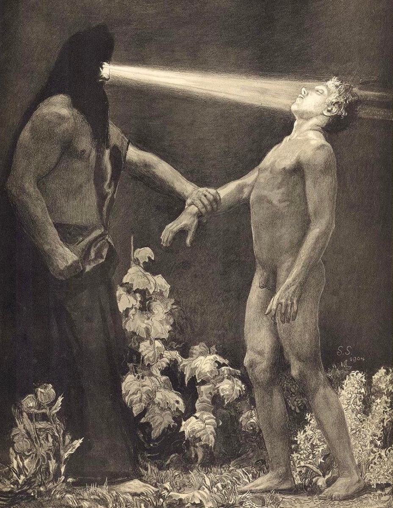
<figcaption>Sascha Schneider, <em>Hypnosis</em>, 1904</figcaption>
</figure>

<figure class="scrap scrap-img">
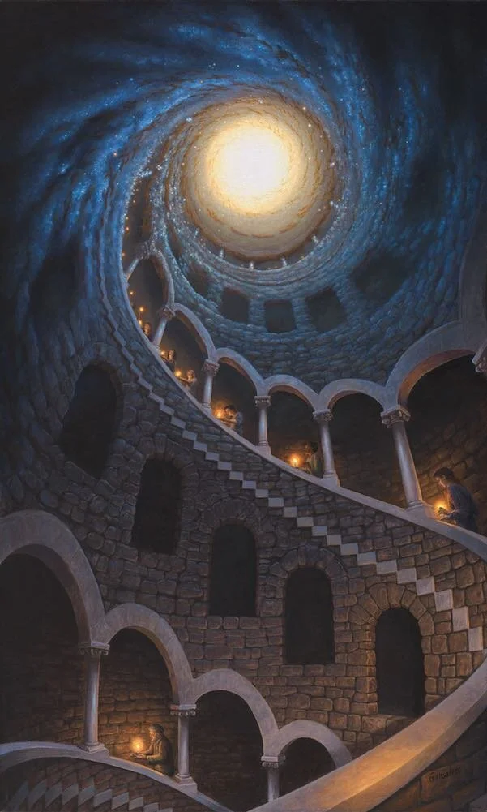
<figcaption>Rob Gonsalves, <em>Stardust</em></figcaption>
</figure>

<button type="button" class="yt-facade" data-video-id="SiliSEuBpIY" aria-label="Play: Ornstein, Piano Quintet">

</button>
Ornstein, Piano Quintet

<button type="button" class="yt-facade" data-video-id="P4nzBNnDXrU" aria-label="Play: Ornstein, A Morning in the Woods">

</button>
Ornstein, A Morning in the Woods

<button type="button" class="yt-facade" data-video-id="mkWcA94EYSo" aria-label="Play: Medtner, the piano sonatas">

</button>
Medtner, the piano sonatas

<button type="button" class="yt-facade" data-video-id="f0nlJXooIVc" aria-label="Play: Godowsky, Passacaglia (Siirala)">

</button>
Godowsky, Passacaglia (Siirala)

<h3>Amores III</h3>
<pre>as is the sea marvelous
from god’s
hands which sent her forth
to sleep upon the world
&nbsp;
and the earth withers
the moon crumbles
one by one
stars flutter into dust
&nbsp;
but the sea
does not change
and she goes forth out of hands and
she returns into hands
&nbsp;
and is with sleep....
&nbsp;
love,
     the breaking
&nbsp;
of your
        soul
        upon
my lips</pre>
E. E. Cummings, Tulips and Chimneys

<figure class="scrap scrap-img">
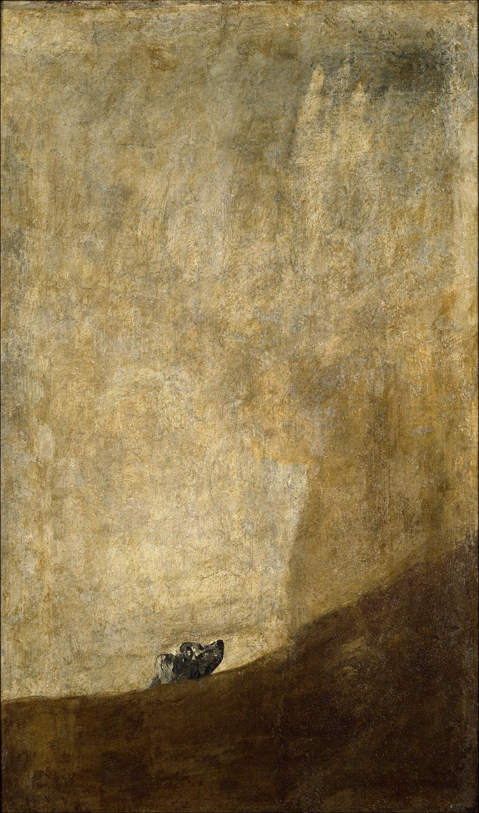
<figcaption>Goya, <em>El Perro</em>, c. 1819–23</figcaption>
</figure>

<button type="button" class="yt-facade" data-video-id="krFB-z40sg8" aria-label="Play: Scriabin, Sonata no. 5 (Laul)">

</button>
Scriabin, Sonata no. 5 (Laul)

<button type="button" class="yt-facade" data-video-id="UANg77DkO8A" aria-label="Play: Scriabin, Vers la flamme (Volodos)">

</button>
Scriabin, Vers la flamme (Volodos)

<button type="button" class="yt-facade" data-playlist-id="OLAK5uy_nX72XLIl9Rp1BKq9NDGcoVdX72b13YhHg" aria-label="Play: Scriabin, the symphonies (Ashkenazy)">

</button>
Scriabin, the symphonies (Ashkenazy)

<figure class="scrap scrap-img">
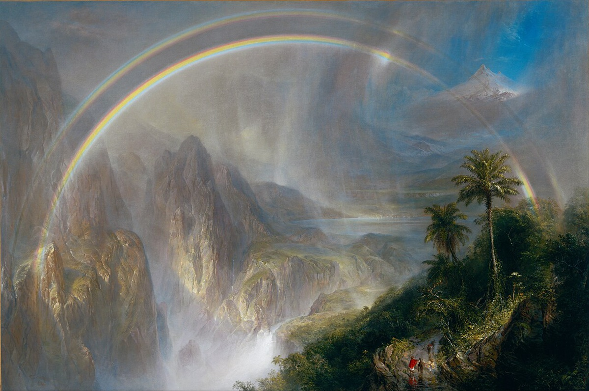
<figcaption>Frederic Edwin Church, <em>Rainy Season in the Tropics</em>, 1866</figcaption>
</figure>

<button type="button" class="yt-facade" data-video-id="I8aN6lPxogA" aria-label="Play: Prokofiev, Violin Concerto no. 1 (Hahn)">

</button>
Prokofiev, Violin Concerto no. 1 (Hahn)

<h3>Dream</h3>

—after three pints of Vanzeelli’s wine 
and a very great deal of conversation

I rose and walked sunward. 
Bolts flew to my eyes and burst. 
Time passed but I stopped him. 
He drew a century from his wallet 
And gave it to me. 
But I could not spend it— 
I gave it away. 
Thoughts from behind me ran ahead. 
They drove on into the heavens 
With the fury of rockets. 
They possessed the world for one moment 
Before the earth tugged me back to her bosom. 
I writhed and writhed until I lay awake, 
Listening to the city grinding up the dead.

Wilson Askew, Poetry, July 1933

<figure class="scrap scrap-img">
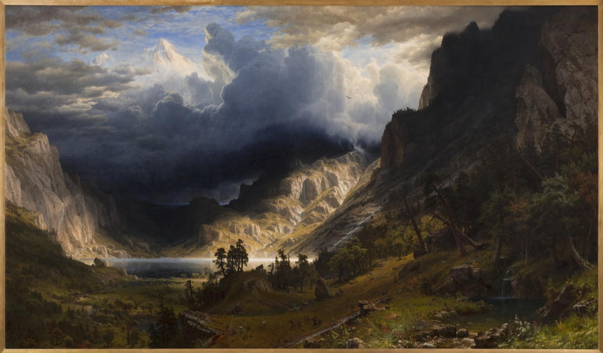
<figcaption>Albert Bierstadt, <em>A Storm in the Rocky Mountains, Mt. Rosalie</em>, 1866</figcaption>
</figure>

<button type="button" class="yt-facade" data-video-id="gnosxO9MDTE" aria-label="Play: Bridge, String Quartet no. 3">

</button>
Bridge, String Quartet no. 3

<button type="button" class="yt-facade" data-video-id="6W-Jkm8Zczo" aria-label="Play: Bridge, String Quartet no. 4">

</button>
Bridge, String Quartet no. 4

<figure class="scrap scrap-img">
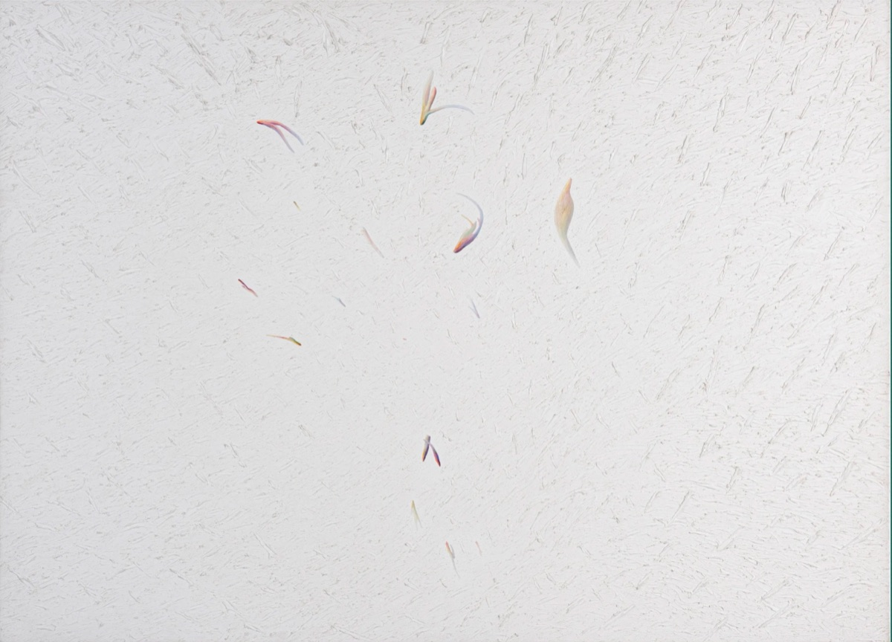
<figcaption>John Dowell, <em>To Move From Infinity</em></figcaption>
</figure>

<button type="button" class="yt-facade" data-video-id="PvkkduAWH40" aria-label="Play: Roslavets, Viola Sonata no. 1">

</button>
Roslavets, Viola Sonata no. 1

<h3>Amores VIII</h3>
<pre>your little voice
                  Over the wires came leaping
and i felt suddenly
dizzy
      With the jostling and shouting of merry flowers
wee skipping high-heeled flames
courtesied before my eyes
                          or twinkling over to my side
Looked up
with impertinently exquisite faces
floating hands were laid upon me
I was whirled and tossed into delicious dancing
up
Up
with the pale important
                       stars and the Humorous
                                              moon
dear girl
How i was crazy how i cried when i heard
                                         over time
and tide and death
leaping
Sweetly
        your voice</pre>
E. E. Cummings, Tulips and Chimneys

<figure class="scrap scrap-img">
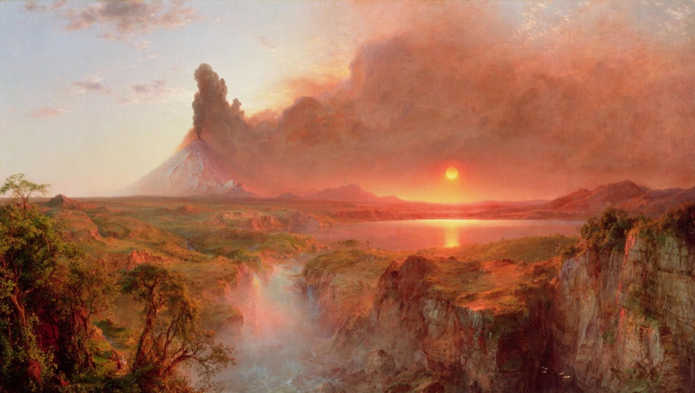
<figcaption>Frederic Edwin Church, <em>Cotopaxi</em>, 1862</figcaption>
</figure>

<button type="button" class="yt-facade" data-video-id="wcIByhmCi1I" aria-label="Play: Qigang Chen, Enchantements oubliés">

</button>
Qigang Chen, Enchantements oubliés

<figure class="scrap scrap-img">
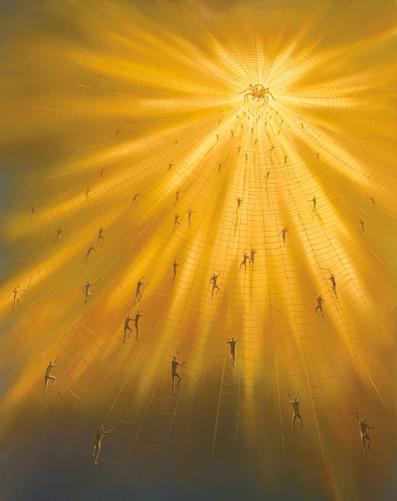
<figcaption>Vladimir Kush, <em>Shine of Gold</em></figcaption>
</figure>

<button type="button" class="yt-facade" data-video-id="oEghV-AJ230" aria-label="Play: Messiaen, Turangalîla-Symphonie">

</button>
Messiaen, Turangalîla-Symphonie

<button type="button" class="yt-facade" data-video-id="eyUiZ43Eq3Y" aria-label="Play: Messiaen, Cloches d’angoisse et larmes d’adieu">

</button>
Messiaen, Cloches d’angoisse et larmes d’adieu (Prélude no. 6)

<figure class="scrap scrap-img">
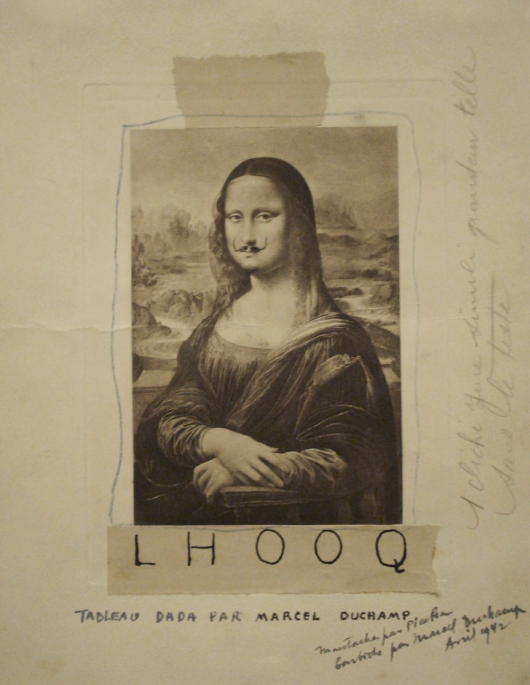
<figcaption>Marcel Duchamp, <em>L.H.O.O.Q.</em>, 1919</figcaption>
</figure>

<button type="button" class="yt-facade" data-video-id="qj1luIOQHLw" aria-label="Play: Scriabin, Sonata no. 9 (Sokolov)">

</button>
Scriabin, Sonata no. 9 &ldquo;Black Mass&rdquo; (Sokolov)

<figure class="scrap scrap-img">

<figcaption>Egor Kamalev, <em>Scenic View of Night Sky</em></figcaption>
</figure>

<button type="button" class="yt-facade" data-video-id="gYj3nP6l6DA" aria-label="Play: Lili Boulanger, Du fond de l’abîme">

</button>
Lili Boulanger, Du fond de l’abîme

<button type="button" class="yt-facade" data-video-id="nz08VTgYprg" aria-label="Play: Michel Chion, Requiem">

</button>
Michel Chion, Requiem

<button type="button" class="yt-facade" data-video-id="qDyeqeGcwYM" aria-label="Play: Bridge, Cello Sonata">

</button>
Bridge, Cello Sonata

<figure class="scrap scrap-img">
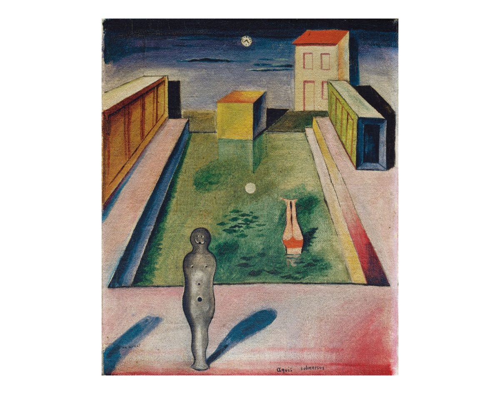
<figcaption>Max Ernst, <em>Aquis Submersus</em>, 1919</figcaption>
</figure>

<h3>Three VIII</h3>
<pre>will out of the kindness of their hearts a few philosophers tell me
what am i doing on top of this hill at Calchidas,in the sunlight?
down ever so far on the beach below me a little girl in white spins,tumbles:rolling in sand.
across this water,crowding tints:browns and whites shoving, the doting millions of windows of thousands of houses—Lisboa.   Like the crackle of typewriter,in the afternoon sky.
goats and sheep are driven by somebody along a curve of road which eats into a pink cliff back and up leaning out of yellowgreen water.
&nbsp;
they are building a house down there by the sea,in the afternoon.
&nbsp;
rapidly a reddish ant travels my fifth finger.
a bird chirps in a tree,somewhere nowhere
and a little girl in white is tumbling
in sand
        Clouds over
me are like bridegrooms
&nbsp;
Naked and luminous
&nbsp;
                   (here the absurd I;life,to peer and wear clothes. i am altogether foolish,i suddenly make a fist out of ten fingers
voices rise from down ever so far—
hush.
        Sunlight,
                 there are old men behind me I tell you;several,incredible,sleepy</pre>
E. E. Cummings, is 5

<button type="button" class="yt-facade" data-video-id="S3IIpe0WxQk" aria-label="Play: Dvořák, Slavonic Dance op. 72 no. 2 (Cziffra)">

</button>
Dvořák, Slavonic Dance op. 72 no. 2 (Cziffra)

<figure class="scrap scrap-img">
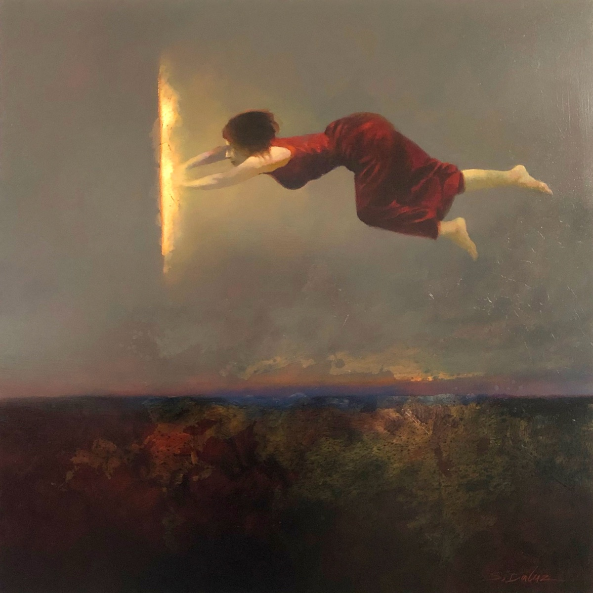
<figcaption>Steven DaLuz, <em>Rip</em></figcaption>
</figure>

<button type="button" class="yt-facade" data-video-id="Svfj0djV9Mw" aria-label="Play: Chopin, Nocturne op. 48 no. 1 (Pogorelich)">

</button>
Chopin, Nocturne op. 48 no. 1 (Pogorelich)

<button type="button" class="yt-facade" data-video-id="s-6OHzO7TfI" aria-label="Play: Liszt, Wilde Jagd (Pogorelich)">

</button>
Liszt, Wilde Jagd (Pogorelich)

<button type="button" class="yt-facade" data-video-id="GIU_s0hvT5M" aria-label="Play: Liszt, Appassionata (Pogorelich)">

</button>
Liszt, Appassionata (Pogorelich)

<button type="button" class="yt-facade" data-video-id="NszcVZzluUE" aria-label="Play: Ravel, Scarbo (Gavrilov)">

</button>
Ravel, Scarbo (Gavrilov)

